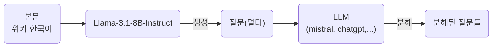
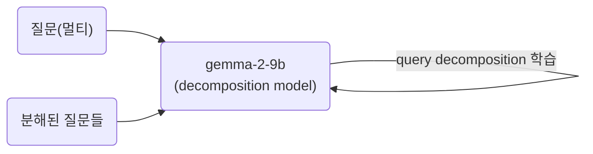
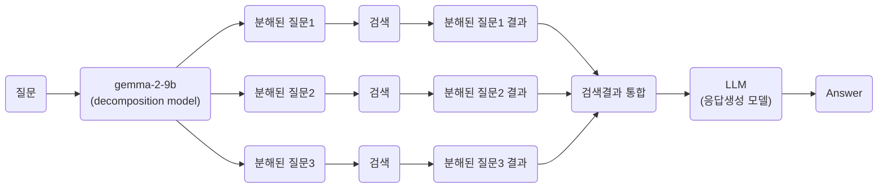

## Overview





---

## 1. 데이터 생성

### 1. 질문(멀티) 생성


**본문**으로부터 한번의 질문으로 여러가지를 물어보는 **질문(멀티)**을 생성

> **질문(멀티)**: 한 번에 2가지 이상을 묻는 질문
> 
> 
> (예시) 역대급 중단이 발생한 일자와 그 원인은 무엇인가?
> 
> - 역대급 중단이 발생한 일자는 언제인가?
> - 역대급 중단이 발생한 원인은 무엇인가?

### 예시

```python
본문:
    2024년 7월 19일, 미국의 사이버 보안 회사인 크라우드스트라이크가 제작한 보안 소프트웨어의 잘못된 업데이트로 인해 마이크로소프트 윈도우를 실행하는 수많은 컴퓨터와 가상 머신이 충돌했다. 전 세계의 기업과 정부는 정보 기술 역사상 최대 규모의 중단으로 묘사되는 사태로 인해 영향을 받았다.[1]

    붕괴된 산업 중에는 항공사, 공항, 은행, 호텔, 병원, 제조, 주식 시장, 방송 등이 있었다. 긴급 전화번호, 웹사이트 등 정부 서비스도 영향을 받았다. 오류가 발견돼 당일 수정됐지만, 사고로 인해 항공 항공편이 계속 지연되고 전자 결제 처리에 문제가 발생하며 응급 서비스가 중단되는 등의 문제가 발생하고 있다.[2][3][4][5]

    시아란 마틴(Ciaran Martin)의 추정에 따르면 이번 사고로 인해 수십억 파운드에 달하는 경제적 피해가 발생할 것으로 예상된다.
```

```python
질문:
    1. 역대급 중단이 발생한 일자와 그 원인은 무엇인가?
    2. 중단 사태로 피해를 입은 분야들과 피해 금액은 얼마인가?
```
     

---

### 2. 분해된 질문들 생성


LLM을 통해 질문(멀티)로부터 질문들을 분해

**질문(멀티)**과 **분해된 질문들**로 question decomposition 모델을 학습

### 예시

```python
질문(멀티):
    중단 사태로 피해를 입은 분야들과 피해 금액은 얼마인가?
```

```python
분해된 질문들:
    1. 중단 사태로 피해를 입은 분야들은 어디인가?
    2. 중단 사태로 피해를 입은 피해 금액은 얼마인가?
```

---

## 2. 질문(멀티), 질문들로 LLM을 추가 학습

- 학습모델: [google/gemma-2-9b-it](https://huggingface.co/google/gemma-2-9b-it)
- 학습GPU: A100 80G 1EA
- Q-Lora 학습:
    - BitsAndBytes, 4bits, nf4
    - r: 6
    - alpha: 8
    - dropout: 0.05
    - modules: "q_proj", "k_proj", "v_proj", "o_proj", "gate_proj", "up_proj", "down_proj”
- 학습 파라미터
    - num_train_epochs = 10
    - per_device_train_batch_size=4
    - gradient_accumulation_steps=4
    - optim="paged_adamw_32bit"
    - warmup_steps=25
    - learning_rate=1e-4
- 프롬프트
    - 학습 프롬프트
    
    ```bash
    <bos><start_of_turn>user
    당신은 하나의 복잡한 질문을 2개 이상의 단순한 정보를 물어보는 질문으로 변경해 주는 역할을 하는 어시스턴트입니다.
    다음 질문을 2개 이상의 단순한 정보를 물어보는 질문으로 변경해주세요.:
    
    질문: {}<end_of_turn>
    <start_of_turn>model
    {}<end_of_turn><eos>
    ```
    
    - 학습 프롬프트에 데이터 적용 후
    
    ```bash
    <bos><start_of_turn>user
    당신은 하나의 복잡한 질문을 2개 이상의 단순한 정보를 물어보는 질문으로 변경해 주는 역할을 하는 어시스턴트입니다.
    다음 질문을 2개 이상의 단순한 정보를 물어보는 질문으로 변경해주세요.:
    
    질문: 박보검의 출생일과 본관은 무엇인가?<end_of_turn>
    <start_of_turn>model
    1. 박보검 출생일은 언제인가?
    2. 박보검의 본관은 어디인가?
    3. 박보검 출생지는 어디인가?<end_of_turn><eos>
    ```
    
    - 추론 프롬프트
    
    ```bash
    <bos><start_of_turn>user
    당신은 하나의 복잡한 질문을 2개 이상의 단순한 정보를 물어보는 질문으로 변경해 주는 역할을 하는 어시스턴트입니다.
    다음 질문을 2개 이상의 단순한 정보를 물어보는 질문으로 변경해주세요.:
    
    질문: {}<end_of_turn>
    <start_of_turn>model
    
    ```
    
    - 추론 프롬프트에 데이터 적용 후
    
    ```bash
    <bos><start_of_turn>user
    당신은 하나의 복잡한 질문을 2개 이상의 단순한 정보를 물어보는 질문으로 변경해 주는 역할을 하는 어시스턴트입니다.
    다음 질문을 2개 이상의 단순한 정보를 물어보는 질문으로 변경해주세요.:
    
    질문: 박보검의 출생일과 본관은 무엇인가?<end_of_turn>
    <start_of_turn>model
    
    ```
    
- 학습 결과 비교
    - 질문
    
    ```bash
    이종린의 문학 작품과 대표적인 작품은 무엇이며, 그의 문학적 위치는 어떠한가요?
    ```
    
    - 추가 학습 하기 전 [google/gemma-2-2b-it](https://huggingface.co/google/gemma-2-2b-it) 답변
    
    ```bash
    ## 이종린 문학 작품과 대표적인 작품, 그리고 그의 문학적 위치에 대한 정보를 어떻게 얻을 수 있나요? 
    
    **1. 이종린의 문학 작품에 대한 정보를 얻으려면:**
    
    * **어떤 작품을 이종린이 쓰고 있는지 알려주세요.** 
    * **이종린의 작품을 어떤 분야로 분류하는 것이 가장 적절한가요?** (예: 시, 소설, 에세이 등)
    
    **2. 이종린의 문학적 위치에 대한 정보를 얻으려면:**
    
    * **이종린의 작품을 다른 작가들과 비교하거나, 그의 작품과 관련된 다른 작가들과 어떤 관계를 맺고 있는지 알려주세요.**
    * **이종린의 작품이 어떤 시대적, 사회적, 문화적 맥락에서 어떤 위치를 차지하는지 알려주세요.** 
    
    이러한 질문들을 통해 이종린의 문학 작품과 대표적인 작품, 그리고 그의 문학적 위치에 대한 정보를 더욱 깊이 있게 파악할 수 있을 것입니다.
    ```
    
    - 추가 학습 후 [google/gemma-2-2b-it](https://huggingface.co/google/gemma-2-2b-it) 답변
    
    ```bash
    1. 이종린의 문학 작품은 무엇인가?
    2. 이종린의 대표적인 작품은 무엇인가?
    3. 이종린의 문학적 위치는 어느정도인가?
    ```
    
- 추가 학습 전/후 결과 비교
    - gemma-2-2b-it 모델 추가 학습 전에는 명확하게 질문을 구분하지 못하는 경우가 많음
    - gemma-2-2b-it 모델 추가 학습 후 답변이 개선 되는 것을 확인할 수 있음
    
    [gemma_2_2b_results_out.xlsx](https://github.com/mjlee5929/C_H_M/raw/refs/heads/main/gemma_2_2b_results_out.xlsx)
    

---

## 3. query decomposition

유저의 질문을 다수의 질문들로 나누어 관련 문서를 찾아올 때 활용



- 다음과 같이 질문을 분해하여 하나의 질문으로 검색하는 것이 아닌 복합적인 질문을 나누고 검색결과를 모두 합하여 답변생성에 활용
